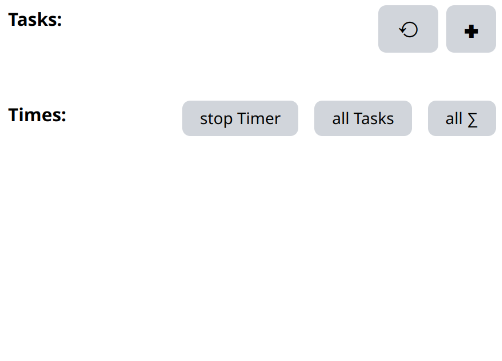
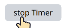

# Tasks n' Times
A CLI tool to keep track of how long certain Tasks have taken

<!-- vim-markdown-toc GFM -->

* [Goal of the Project](#goal-of-the-project)
* [installation](#installation)
* [Usage](#usage)
    * [The Commandline interface](#the-commandline-interface)
        * [Switching to another task.](#switching-to-another-task)
        * [Getting a list of Tasks and how much time was spend in them](#getting-a-list-of-tasks-and-how-much-time-was-spend-in-them)
        * [Getting a full list of Times](#getting-a-full-list-of-times)
        * [Filtering the times](#filtering-the-times)
    * [Shell - Autocompletion:](#shell---autocompletion)
* [The Web interface](#the-web-interface)
* [A word on Timers](#a-word-on-timers)
* [Probabbly asked Questions](#probabbly-asked-questions)
* [Build it yourself](#build-it-yourself)

<!-- vim-markdown-toc -->


# Goal of the Project

I had a lot of "Project-Hopping" to do lately, and can barely keep track of what toke how long.
This tool is meant to make things easier by documenting when and how long certain Tasks have been executed.

# installation
- grab one of the Binaries from the [Releases - Section](https://github.com/Rocco-Gossmann/tnt/releases/latest)
- rename it to `tnt` (for Linux/Unix) or `tnt.exe` (for Windows)
- put it into a directory that is listed in your $PATH or %PATH%
- setup the Autocompletion as described further down in [Autocompletion](#autocompletion)
Done

Alternatively, you can run the `tnt` / `tnt.exe` from any directory you like.
Having it in your `$PATH`/`%PATH%` just makes it possible to call it from other directories.

Should your system not be covered by the precompiled binaries, please use the
build guide further down [Build it yourself](#build-it-yourself)


# Usage
> [!info]
> Despite this being a CLI-Tool, there is also a [Web interface](#the-web-interface), 
> if the CLI is not your cup of tea. Just look further down in this README  
> 
> It does not have all the CLI features yet. But I'm working on it.

## The Commandline interface
This application was primarily designed ot be used from the command line first.


Easily usable via Windows Powershell/CMD or Unix Bash, ZSH, etc. 

```bash
# first create some Tasks 
tnt tasks add "important project nr 1"
tnt tasks add "very important project"
tnt tasks add "some side project"
tnt tasks add "learning new stuff"
   
# you can see what task you created via
tnt tasks ls

# To remove a task and all its Recorded Times use
tnt tasks rm "some side project";
```

to start tracking times, use:
```bash
tnt s "important project nr 1"

#or
tnt start "important project nr 1"

#or
tnt switch "important project nr 1"

#these 3 are aliasses for the the same function
```

now the timer for "important project nr 1" is running until you either start
another timer via `s`, `start` or `switch`

or, if you want to stop the timers (for example because your shift is over) call:

```bash
tnt stop
```

### Switching to another task.
switching tasks is as easy as calling
```bash
tnt s "what ever is your new task"
```
Should another timer be running currently, it will be stopped and a new timer for the new task is started.


### Getting a list of Tasks and how much time was spend in them
just run.

```bash
tnt times sum 
```
and you'll get a list of all Tasks and how much time you've spend with them in total.

### Getting a full list of Times
To find out, when you did what, you can use the 
```bash
tnt times ls
```
command. The most current started timer is on top.
The oldest timer is on the bottom.

### Filtering the times 
both of the `tnt times` commands can take a `-t` or `--task` flag, to filter the results for a given Task.
The value for this flag is the Taskname give during `tnt task add` or used during `tnt s | start | switch`.


## Shell - Autocompletion:
This tool was build with auto completion im mind, as Task names can become quite long.
Autocompletion make switching between Tasks/Timers very fritctionless.

on bash you can activate the autocomletion by putting the following in your .bashrc.
```bash
source <(tnt completion bash)
```

For ZSH put this into your .zshrc
```bash
source <(tnt completion zsh)
```

Check the following command for more autocompletion options
```bash
tnt completion 
```


# The Web interface
don't worry, despite it saying "Web", no data will ever leave your computer.
Instead your default browser is just used as an input and output.

To use Tasks 'n Times via the Web-Interface, call the following command from the
command line.
```bash
tnt serve --open
```
By default it opens on Port 7353.
Should that port not be available or allowed, you can define another one via the `-p` or `--port` flag.

```bash
tnt serve --open --port 8088
```

You can also combine the two flags via their short form.
```bash
tnt serve -op 8088
```

From their, you are presented with this interface here.
While not pretty, it works for now.



The Reload Tasks - Button at the top can be used in case you added new Tasks via the 
command line, while the server was running. (But a simple F5 Page-Refresh does the job too.)

Below that, you have the Task-Input section. Here you create new Tasks and add them to your ever expanding List of Jobs.  


After that, is your Task-List.  


 The Cross-button removes a Task and all its recorded times from the List.  
 The Play-button starts a new Timer for that Task.  
 Shows the total time you spend in that task.

>[!info]
Starting a new Timer will automatically finish the previous running Timer.

Below that, you have the Times section.


You can click on a Tasks name to filter the times for that Task.  


  stops what ever timer is crently running.  
 Shows the times for all Tasks  
 Shows the Summed times per Task for all Tasks.  
 As with the Tasks, the Cross button next to a Time, removes that time. 


# A word on Timers
This applications job is to serve as stopwatch like timer.
However, the times are recorded passively. That means, even if you turn of your computer,
the timer will still be running, until it is stopped. 

Times are taken after a Task was stopped, by substracting the end time from the start time.

That way, you don't have to have the App open at all times, just when you need to interact with it.

# Probabbly asked Questions
 **Q**: Where does `tnt` store it's persistent Data?
> All it's data is stored in the `$HOME/.local/share/tnt` directory.
> On Windows that should be `%USERPROFILE%\.local\share\tnt`.

 **Q**: Will the Web-Interface track my data or install anything ?
> No

# Build it yourself

- Install GO (https://go.dev/doc/install) 
- clone this repo
```bash
git clone https://github.com/Rocco-Gossmann/tnt.git
```
- Enter the directory
```bash
cd tnt
```

- Build the project
```bash
CGO_ENABLED=1 go build -ldflags="-s -w -X main.Version=`git describe --tags --abbrev=0`"
```

- Copy the `tnt` file into one of the directories listed by your environment vars $PATH or %PATH% var
- or extend $PATH 
```bash
echo "export PATH=\"`pwd`:\$PATH\"" >> ~/.bashrc

# or for ZSH

echo "export PATH=\"`pwd`:\$PATH\"" >> ~/.zshrc
```

Should you want to change anything regarding the Web-Interface, 
please use the [Tailwind-CLI](https://github.com/tailwindlabs/tailwindcss/releases/latest) for that.
 
Enter the `pkg/serve/views` directory and then run

```bash
tailwindcss -i main.tw.css -o main.css
```


